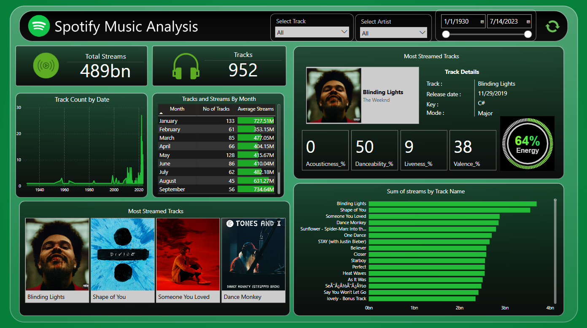

# Power-BI-Dashboard-for-Spotify-Music-Analysis
This repository contains a Power BI Dashboard for Spotify Music Analysis (2023). The dashboard visualizes key insights from Spotify's top tracks, including artists, total streams, most popular tracks, release dates... etc. It provides an interactive way to explore music trends in 2023.

## Features

- **Top Tracks & Artists** - Displays the most streamed tracks along with their respective artists.
- **Total Streams Analysis** - Visualizes the total number of streams per track.
- **Most Popular Tracks** - Identifies the highest-ranked songs based on popularity.
- **Release Date Insights** - Shows the distribution of songs by release year.
- **Interactive Filtering** - Allows dynamic filtering to explore specific artists, tracks, or time periods.

## Tools Used

- **Power BI** - For data visualization and dashboard creation.
- **Spotify Dataset (2023)** - Source data containing track details, streams, and popularity metrics.
- **Excel/CSV** - Data preprocessing and structuring before importing into Power BI.



## How to Use

1. **Clone this repository**:
   ```bash
   git clone https://github.com/PiyumiNadeera/Power-BI-Dashboard-for-Spotify-Music-Analysis.git

2. **Open the Power BI file:**
   
Navigate to the folder where you cloned the repository.
Open the .pbix file (Power BI file) using Power BI Desktop.

3. **Connect to your dataset:**
   
In Power BI, click on Get Data and choose the appropriate data source (e.g.: Excel).
Import your sales data to populate the dashboard.

4. **Explore the dashboard:**

Use the interactive filters to view different metrics based on tracks, streams and artists.

## Contact
For any questions or feedback, feel free to reach out to:
Author: Piyumi Nadeera (dlpnadeera1234@gmail.com)
